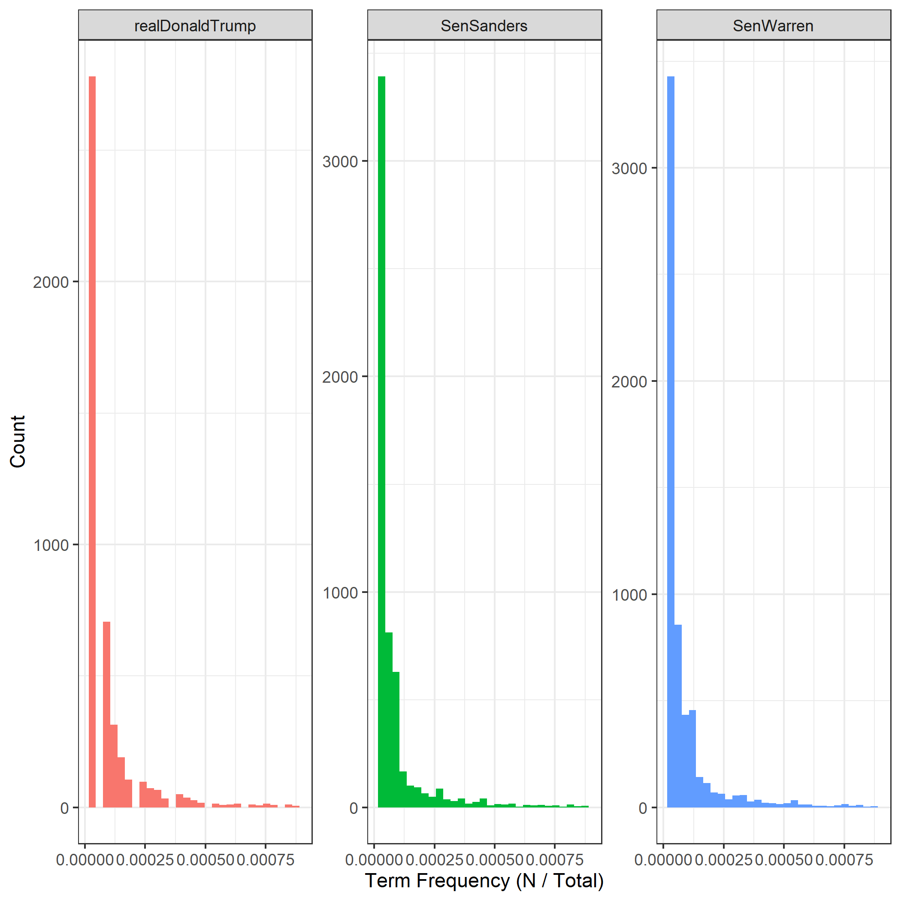
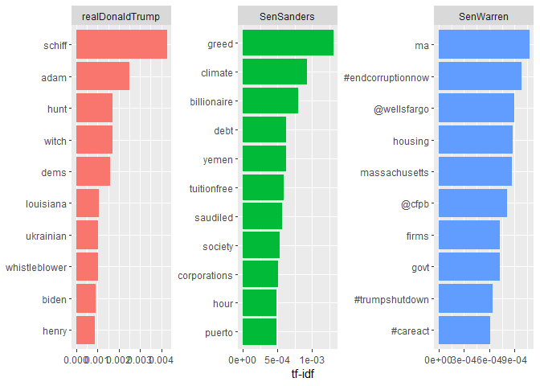

Tf-idf analysis of politicians’ recent tweets
================

## Setup

``` r
# load libraries ----
library(rtweet)
library(tidyverse)
library(tidytext)

# authenticate for Twitter API access ---- 
# first establish authentication. Replace the dummy values below with your own
create_token(
  app = "my_twitter_research_app",
  consumer_key = "XYznzPFOFZR2a39FwWKN1Jp41",
  consumer_secret = "CtkGEWmSevZqJuKl6HHrBxbCybxI1xGLqrD5ynPd9jG0SoHZbD",
  access_token = "9551451262-wK2EmA942kxZYIwa5LMKZoQA4Xc2uyIiEwu2YXL",
  access_secret = "9vpiSGKg1fIPQtxc5d5ESiFlZQpfbknEN1f1m2xe5byw7")
```

#### If you forgot to set up a Twitter app or don’t know how to get these values see [this tutorial](https://rtweet.info/articles/auth.html)

## 1 - Collect politicians’ most recent 1000 tweets

#### (Or jump to step 2 if you’ve downloaded the [“politician\_timelines\_10.27.19”](https://drive.google.com/open?id=1xF6fppwi8BGlnuWjEb54UzEj2kzNBZu-&authuser=wjb260@nyu.edu&usp=drive_fs) data directly)

``` r
# get Trump, Warren and Bernie's most recent 1000 tweets
trump <- get_timelines("realdonaldtrump", n = 1000)
warren <- get_timelines("SenWarren", n = 1000)
bernie<- get_timelines("SenSanders", n = 1000)

# combine data
politicians <- rbind(trump, warren, bernie)

# select only columns we need for tf-idf analysis
politicians_clean <- politicians %>% select(screen_name, text)
```

## 2 - Preprocessing

``` r
# if loading downloaded data
politicians_clean <- read_csv("politician_timelines_10.27.19.csv")

# put data into tidy text format - note we use 'token = 'tweets'' for twitter-specific text preprocessing
politicians_tidy <- politicians_clean %>% 
  unnest_tokens(word, text, token = "tweets")
```

## 3 - Term frequency exploration

``` r
# check out distribution of words across politicians
tweet_words <- politicians_tidy %>% count(screen_name, word, sort = TRUE)

# get total words to look at term frequency distributions
total_words <- tweet_words %>% 
  group_by(screen_name) %>% 
  summarize(total = sum(n))

tweet_words <- left_join(tweet_words, total_words)

# show distribution of words in politicians tweets -- typically see skewed frequency distri described by Zipf's law. 
# Applies to Twitter as well. But Trump's distribution looks a bit fragmented...
ggplot(tweet_words, aes(n/total, fill = screen_name)) +
  geom_histogram(show.legend = FALSE) +
  xlim(NA, 0.0009) +
  facet_wrap(~screen_name, scales = "free_y") +
  labs(x = "Count", y = "Term Frequency (N / Total)") + 
  theme_bw()
```

<!-- -->

## 4 - Tf-idf analysis - what are the most “important” words for each politician’s recent tweets?

``` r
# compute tf-idf to find each politicians' most "important" words in recent tweets
tweet_words <- tweet_words %>%
  bind_tf_idf(word, screen_name, n)

# visualize to check out top 10 important words for each politician
tweet_words %>%
  arrange(desc(tf_idf)) %>%
  mutate(word = factor(word, levels = rev(unique(word)))) %>% 
  group_by(screen_name) %>% 
  top_n(10) %>% 
  ungroup() %>%
  ggplot(aes(word, tf_idf, fill = screen_name)) +
  geom_col(show.legend = FALSE) +
  labs(x = NULL, y = "tf-idf") +
  facet_wrap(~screen_name, scales = "free") +
  coord_flip()
```

<!-- -->

``` r
# save hi-res version
ggsave("Politician_Twitter_tfidf.png")
```

## 5 - Further analyses

``` r
# I notice a weird token."ma" is Warren's most "important" word. Unclear what that is. Let's investigate:
warren <- politicians_clean %>% filter(screen_name == "SenWarren")

warren %>% 
  filter(str_detect(text, "ma")) %>% 
  select(text)
```

    ## # A tibble: 398 x 1
    ##    text                                                                    
    ##    <chr>                                                                   
    ##  1 The @USArmy’s report suggests ways it can combat the #ClimateCrisis: re~
    ##  2 A @USArmy report says the climate crisis will cause more frequent power~
    ##  3 @RepCummings Chairman @RepCummings introduced the CARE Act w/ @SenWarre~
    ##  4 Amazon Web Services knew – or should have known – that its servers used~
    ##  5 Today @SenDuckworth, @SenWarren, @SenBlumenthal and I demanded the Trum~
    ##  6 I’m concerned that big banks are using short-term lending market volati~
    ##  7 Almost 2/3 of US hospitals outsource physician staffing, many to compan~
    ##  8 Sec. @BetsyDeVosED has given a free pass to every swindler &amp; crook ~
    ##  9 Starting in 2007, our country made a promise to public servants: pay yo~
    ## 10 Secretary @BetsyDeVosED &amp; the Trump admin wrecked the Public Servic~
    ## # ... with 388 more rows

#### Nothing looks weird above (“ma” is not being used separately from a quick visual inspection). So its happening in the tidying step somewhere? This will take some more investigation. What I’m doing is identifiying full tweets that contain “ma” as produced by the tidy function.

``` r
warren_clean <- warren %>% mutate(idx = row_number()) %>% select(idx,text)
warren_tidy <- warren_clean %>%  unnest_tokens(word, text, token = "tweets")
check <- warren_tidy %>% filter(word == "ma") %>% mutate(check = 1) %>% select(idx, check)
warren_check <- warren_clean %>% left_join(check, by = "idx") %>% filter(check == 1)
warren_check
```

    ## # A tibble: 37 x 3
    ##      idx text                                                         check
    ##    <int> <chr>                                                        <dbl>
    ##  1    13 Gwen Ifill was a talented journalist, a trailblazer for wom~     1
    ##  2    15 I’ve spent years fighting side-by-side with our fearless @M~     1
    ##  3    31 Good luck to everyone participating in the Head of the Char~     1
    ##  4    85 11 people have contracted #EEE in MA &amp; 4 have died. @Se~     1
    ##  5   103 Way to go, Boston! I’m proud of our students from across MA~     1
    ##  6   143 18 years ago, nearly 3,000 Americans – including 206 people~     1
    ##  7   159 Five people in MA this year have contracted Eastern equine ~     1
    ##  8   164 I’m concerned about reports of two separate incidents of ra~     1
    ##  9   175 People come to MA from around the world to receive life-sav~     1
    ## 10   181 This pick for @CFPB Student Loan Ombudsman is a slap in the~     1
    ## # ... with 27 more rows

#### By investigating the warren\_check dataset we actually see above it was her use of the state abbreviation for Massachusettes (“MA”). So actually MA was indeed being used separately. Oops. “ma” is meaningful afterall because it represents her referring to Massachusettes.

#### however, if you wanted to remove unmeaningful words you find in your own data just use this method then re-plot:

``` r
stopwords <- tibble(word = c("yourword1", "yourword2", "yourword3"))

tweet_words <- anti_join(tweet_words, stopwords, 
                           by = "word")
```
